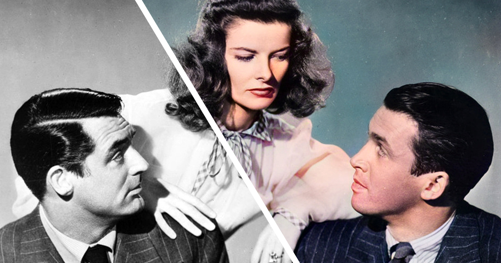

# Picture_Colorizer
<head>
  <h1 align = "center"><b>Picture_Colorizer</b></h1> 
</head>

<b>
This project uses the Deoldify model to recolor an old black-and-white image, and with further improvements it can be scaled to recolor videos as well.
</b>
  
&nbsp;
   
  

    

## Requirements
- Python installed. Also install the given package by using `pip install`
Install Dependencies
- cd Deoldify
- pip install opencv-python==4.4.0.42
- pip install -r requirements.txt (this is the text file containg the necessary dependecies so that you can just install it in one go it inlcude
 - wandb
 - fastai==1.0.60
 - tensorboardX>=1.6
 - ffmpeg
 - ffmpeg-python
 - yt-dlp
 - jupyterlab
 - opencv-python>=3.3.0.10
 - Pillow==9.1.0
 - --extra-index-url https://download.pytorch.org/whl/cu113
 - torch==1.11.0
 - torchvision==0.12.0
 - ipywidgets
) 

Afterwards the model can be runned and a black & white image can be fed to it and it will be giving out a coloured image 
