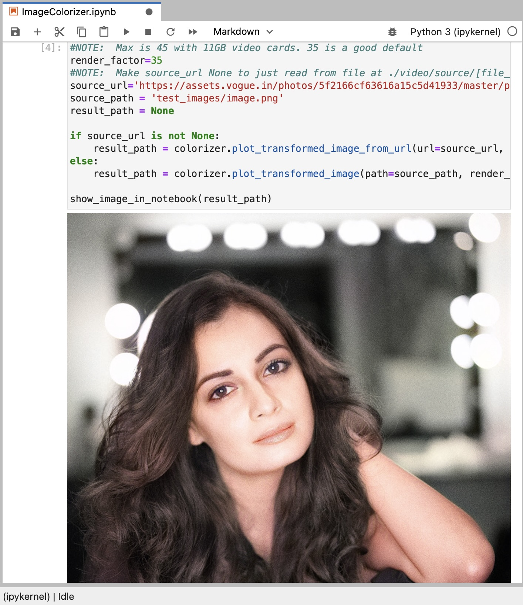
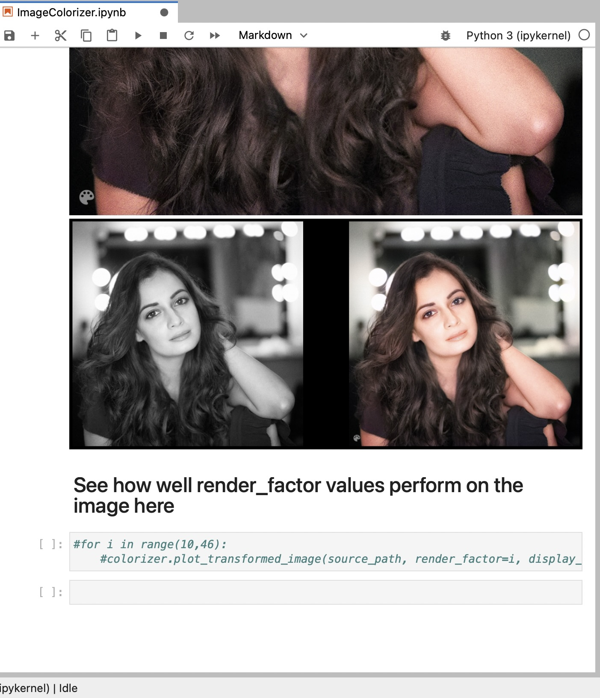

<head>
  <h1 align = "center"><b>Picture_Colorizer</b></h1> 
</head>

<b>
This project uses the Deoldify model to recolor an old black-and-white image, and with further improvements it can be scaled to recolor videos as well.
</b>
  
&nbsp;
   
  

    

## Requirements
- Python installed. Also install the given package by using `pip install`
Install Dependencies
- cd Deoldify
- pip install opencv-python==4.4.0.42
- pip install -r requirements.txt (this is the text file containg the necessary dependecies so that you can just install it in one go it inlcude
  - wandb
  - fastai==1.0.60
  - tensorboardX>=1.6
  - ffmpeg
  - ffmpeg-python
  - yt-dlp
  - jupyterlab
  - opencv-python>=3.3.0.10
  - Pillow==9.1.0
  - --extra-index-url https://download.pytorch.org/whl/cu113
  - torch==1.11.0
  - torchvision==0.12.0
  - ipywidgets
) 

Following that, you can run this model and feed it a black & white image, and it will output a coloured one. This is a new type of GAN training that has been used here to solve some key problems in the previous DeOldify model. It provides the benefits of GAN training while spending minimal time doing direct GAN training. Instead, most of the training time is spent pretraining the generator and critic separately with more straight-forward, fast and reliable conventional methods. A key insight here is that those more "conventional" methods generally get you most of the results you need, and that GANs can be used to close the gap on realism. During the very short amount of actual GAN training the generator not only gets the full realistic colorization capabilities that used to take days of progressively resized GAN training, but it also doesn't accrue nearly as much of the artifacts and other ugly baggage of GANs. In fact, you can pretty much eliminate glitches and artifacts almost entirely depending on your approach.

&nbsp;
   
  

    

&nbsp;
   
  

    

